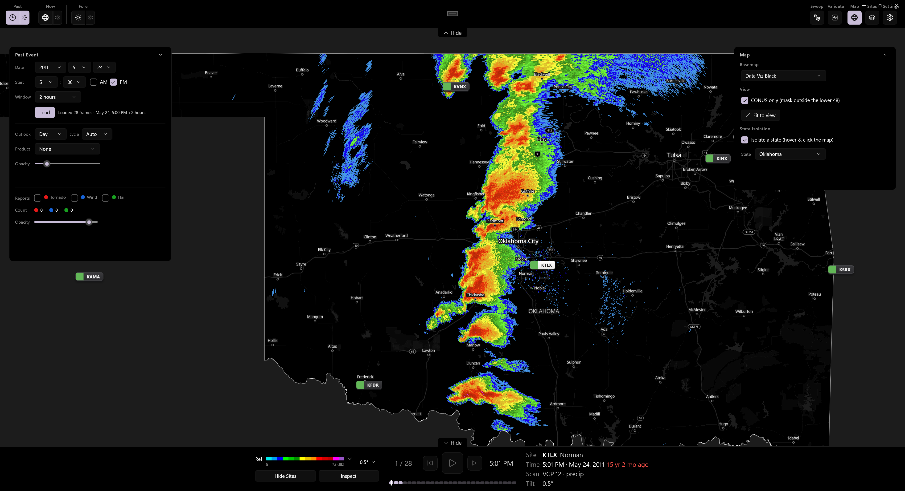
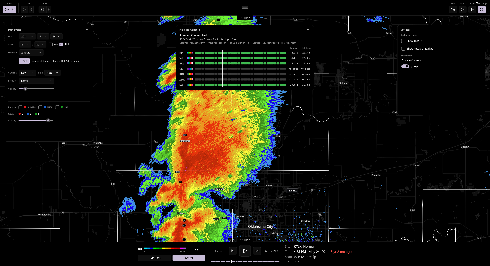

# Anvil

**Severe-weather workstation for Windows.** Decodes NEXRAD Level II radar from raw base data — live or
replayed from the archive — and GPU-renders it over local, fully style-controlled vector basemaps, with
SPC outlooks, watches, warnings, and storm reports layered on top.





## What it does

**Anvil decodes NEXRAD Level II radar itself.** It reads the raw `.V06` volume — Message 31 radials,
per-moment data blocks, VCP and elevation tables — and renders every gate on the GPU. No server-side
rendering, no image tiles. It draws seven products (reflectivity on the standard NWS dBZ scale;
velocity, storm-relative velocity, correlation coefficient, differential reflectivity, specific
differential phase, and spectrum width on ramps built for the app), dealiases velocity with a validated
port of Py-ART's region-based algorithm, and derives storm motion automatically from a full-volume VAD
wind profile. Elevation cuts, SAILS re-scans, and split-cut Doppler companions all resolve from the
volume's own tables. Curated Doppler On Wheels mobile-radar frames render through the same pipeline.

**You can run it live or replay history.** The live loop pulls recent volumes from the AWS archive and
stitches in a near-real-time frame from the chunks bucket, cutting the usual ~10-minute archive latency
to a minute or two. The Past Event Viewer plays any site and date back through the 1990s through the
exact same pipeline — scrub it, loop it, and read the decoded value under the cursor off the Inspector.

**It overlays the severe-weather picture on top.** SPC convective and fire outlooks (Days 1–8, with
significant-area hatching), tornado and severe-thunderstorm watches, storm-based warning polygons from
the authoritative NWS CAP feed, and SPC storm reports as verification dots — all keyed to the right
forecast window, so a replayed event lines up with the outlook that was in effect and the reports that
verified it.

**The basemap is local and fully yours.** Instead of a tile service, Anvil reads one offline PMTiles
archive with style JSON you control, so a cartography change is a file edit and panning costs nothing.
Five styles ship with the app, and a single-state or CONUS isolation mode masks everything else away for
a clean view. If you'd rather not host tens of gigabytes, those same five styles will render from an
online tile source instead — they're tied to the Protomaps *schema*, not to the file, so it's one setting
and the map looks identical either way; offline stays the default. It's a Windows desktop app (WinUI 3,
packaged MSIX) in active development, with the UI mid-rebuild — several capabilities live in the view
models ahead of the controls that expose them.
**Not for operational use;** rely on official NWS products for any safety-of-life decision.

## Run it

| | |
|---|---|
| OS | Windows 10 1809+ (Windows 11 recommended) |
| Build | .NET 8, Windows App SDK 2.1.3, Visual Studio 2022 with the Windows App SDK workload |
| Runtime | WebView2 (preinstalled on Windows 11; Evergreen runtime on Windows 10) |
| Basemap | A local PMTiles archive, or an online tile source — see [docs/setup.md](docs/setup.md) |

```sh
dotnet build Anvil.App/Anvil.App.csproj -c Debug -p:Platform=x64 -p:RuntimeIdentifier=win-x64
```

The platform must be explicit — plain AnyCPU fails during MSIX packaging. Anvil is packaged as MSIX and
depends on package identity for its local caches, so **run it from Visual Studio with F5** (which deploys
the package); the loose `.exe` throws. Anvil ships without a basemap, and without one the map is black
while every overlay still draws. [**docs/setup.md**](docs/setup.md) covers building the archive, where
to put it, the online-tiles alternative, and the rest of the build and test recipes.

## How it's put together

Four projects, with the boundary enforced by target framework: `Anvil.Core` (`net8.0`, no Windows
dependency — models, services, view models), `Anvil.App` (`net8.0-windows` — the WinUI 3 shell and the
web layer), `Anvil.Tests`, and `tools/TiltCheck`. The map is [MapLibre GL JS](https://maplibre.org/) in
a single WebView2, because WebGL rendering can't happen in C#; that web layer is kept narrow, and
everything that can be C# is. [`CLAUDE.md`](CLAUDE.md) is the working map of the codebase — where things
live, how to build, and the gotchas — and `docs/` holds one deep-reference file per area (radar tilts,
velocity dealiasing, the live frame path, product history, decode validation, the replay and DOW
viewers).

## Data sources

| Data | Source |
|---|---|
| NEXRAD Level II | Unidata's archive and chunks buckets on AWS |
| Outlooks, watches, warnings, storm reports | [NOAA/NWS Storm Prediction Center](https://www.spc.noaa.gov/) and NWS map/alert services |
| Basemap | [Protomaps](https://github.com/protomaps/basemaps) — a local archive or the hosted API — © [OpenStreetMap](https://openstreetmap.org) contributors |

The bundled DOW sample comes from NSF NCAR EOL by way of the open-radar-data archive; any `.dow.json`
you add redistributes research data, so use openly licensed archives and carry the citation. Built with
MapLibre GL JS, [PMTiles](https://github.com/protomaps/PMTiles), the `nexrad-level-2-data` decoder,
seek-bzip, and SharpCompress.

Anvil is an independent project — not affiliated with, endorsed by, or supported by NOAA, the National
Weather Service, Unidata, or NSF NCAR.

## About this project

Anvil is self-taught work. I have no formal background in meteorology, radar engineering, or software
development, so expect some non-standard choices. Corrections are welcome, particularly on the
meteorology and the Level II decoding.

## License

[AGPL-3.0](LICENSE.txt). Derivative work must be released under the same license.
